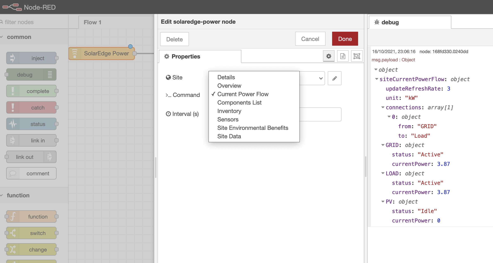

# SolarEdge Power node for Node-RED

This is a node for Node-RED to grab data from your SolarEdge inverter. You'll need an API key and your site ID. Talk to your solar PV installer if you need these.
This is a fork of https://github.com/mattjgalloway/node-red-contrib-solaredge

## Installation

In your Node-RED directory:

```
npm install node-red-contrib-solaredge-power
```

## Usage

This package adds 1 input node and 1 configuration node to Node-RED.

The configuration node defines the site and comprises the following options:

  * **Site ID**: The ID of your site.
  * **API Key**: The API key used to talk to the SolarEdge monitoring API. Must be a site API key, not an account users API key.

The input node comprises the following options:

  * **Site**: The SolarEdge site, defined above.
  * **Command**: The command to run against the SolarEdge monitoring API.
  * **Interval**: The interval, in seconds, between calls to the monitoring API.



### Commands

The following commands are supported:


  * **Details**: This provides the overview of the system, including information such as the name, status, peak power, etc.
  * **Overview**: This provides data such as the lifetime energy output, current power output, etc.
  * **Current Power Flow**:  Retrieves the current power flow between all elements of the site including PV array, storage (battery), loads (consumption) and grid.
  * **Inventory**: Returns the inventory of SolarEdge equipment in the site, including inverters/SMIs, batteries, meters, gateways and sensors.
  * **Data Period**: Returns the energy production start and end dates of the site.
  * **Env Benefits**: Returns all environmental benefits based on site energy production: CO2 emissions saved, equivalent trees planted, and light bulbs powered for a day.
  * **Sensors**: Returns a list of all the sensors in the site, and the device to which they are connected.
  * **List**: Return a list of inverters/SMIs in the specific site..

For more information on the commands, see the [SolarEdge monitoring API documentation](http://www.solaredge.com/sites/default/files/se_monitoring_api.pdf).

## License

MIT
